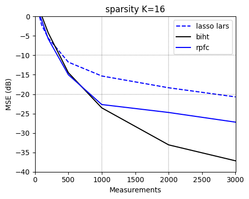
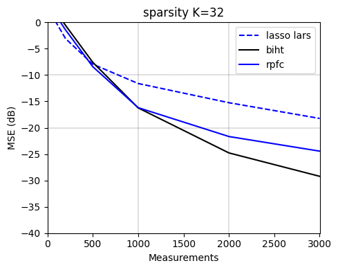

# 1-Bit Compressive Sensing Implementation

Implementation of two algorithms for 1-bit compressive sensing. The notebook uses them to recover synthetic sparse 512-dimensional signals and plots the reconstruction accuracy vs a classical CS lasso-lars baseline. 

More information, including mathematical background and algorithmic details, can be found in `1bit_report.pdf`.

### Running

Running the notebook outputs a plot of the reconstruction accuracy of the RFPI and BIHT algorithms against the number of measurements. We also plot the baseline lasso-lars reconstruction accuracy. It requires numpy, scikit-learn, and matplotlib.

To install dependencies and run, use the commands

```
pip install -r requirements.txt
jupyter notebook 1bit.ipynb
```

### Files

* `onebit.py` contains the implementations of the algorithms and the plotting code.
* `1bit.ipynb` is the notebook that runs the experiments and plots the results.
* `1bit_report.pdf` is the full report, containing mathematical background and algorithmic details.
* `slides.pdf` are the presentation slides.

### Results

Below we show the notebook output for two different sparsities `k`, which plots the reconstruction accuracy for RFPI, BIHT, and the baseline.




